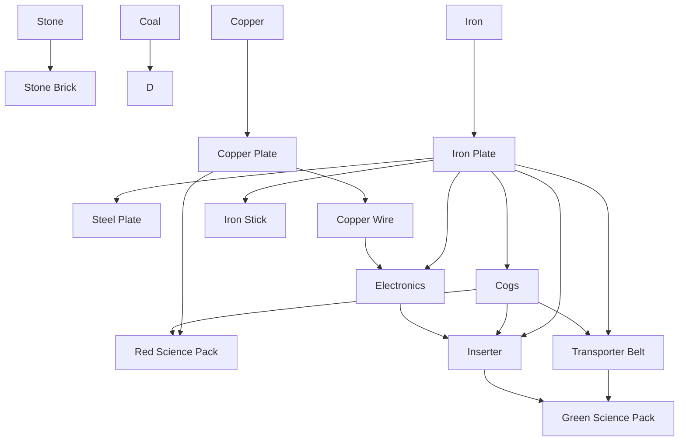

```mermaid
  graph TD;
      Copper--->CP["Copper Plate"];
      Iron--->IP["Iron Plate"];
      Stone-->SB["Stone Brick"];

      Coal-->D;

      IP-->SP["Steel Plate"]

      CP-->CW["Copper Wire"]

    

      IP--->COG["Cogs"]
      IP-->IS["Iron Stick"]
      
      IP--->EL["Electronics"]
      CW-->EL
      
      CP-->RS["Red Science Pack"]
      COG-->RS

      IP-->TB["Transporter Belt"]
      COG-->TB

      IP-->INS["Inserter"]
      COG-->INS
      EL-->INS

      TB-->GS[""Green Science Pack]
      INS-->GS
```
